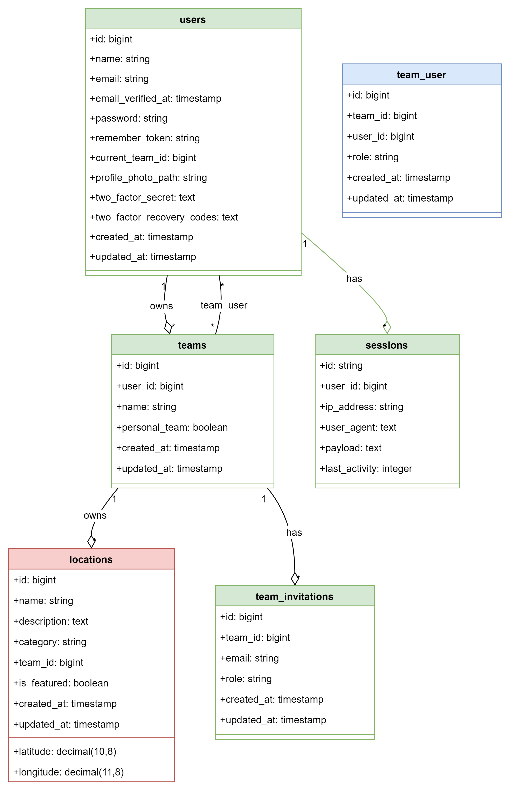

# FullStack Dev technical assessement

## Overview
The goal of this technical assessment is to create a simple yet complete web App with geographical data.
Edit the provided code to allow the creation and edition of named locations.

## Requirements
- PHP 8.3+
- Composer 2.7.1+
- SQLite
- NodeJS 10.11.1+
- npm 10.2.4+

## Installation

### 1. Install dependencies
```bash
composer install
npm install

```

### 2. Environment Setup
```bash
cp .env.example .env
php artisan key:generate
```
Edit the `.env` file to configure your database connection.

### 4. Database Setup
```bash
php artisan migrate
```

### 5. Start the local development server
```bash
composer run dev
```
The application will be available at `http://localhost:8000`.

## Exercices

The application include the package inertia, this mean the front-end side of 
the web app works with vue3Js and TailwindCSS : https://jetstream.laravel.com/introduction.html. 
Provide examples of how to use your application or its key features.

### 1. Location Management System

Create a Location model
Set up appropriate relationships between the Location model and the User model
Implement any necessary accessors or mutators following, you'll find below a class diagramm of DB entities.




### 2. Leaflet.js Map Integration

Create an Inertia page that displays a map using Leaflet.js
Display all locations as markers on the map
When a marker is clicked, show a popup with the location name and description
Implement a form to add new locations by clicking on the map or entering coordinates manually
Add filters to show locations by category 

### 3. Authorization Policies

Implement the following authorization rules using Laravel Policies and Gates:

All authenticated users can view all locations
Users can only edit or delete locations they created
Create an Admin role that can manage all locations
Implement a "featured" status for locations that only admins can toggle

Policy Implementation Requirements

Create a LocationPolicy class
Register appropriate Gates in the AuthServiceProvider
Use the policies in your controllers and Inertia components
Make sure the UI reflects these permissions (hide edit buttons for unauthorized users, etc.)

### 4. User Interface

Create a dashboard page that lists all locations in a table view
Implement CRUD operations for locations
Use Jetstream components where appropriate
Make the interface responsive

### 5. Bonus Tasks (Optional)

Implement real-time updates when a new location is added (using Laravel Echo)
Add location clustering for the map when there are many markers in the same area
Implement a search functionality to find locations by name or description
Add the ability to upload and display an image for each location

### Evaluation Criteria

Code organization and structure
Proper use of Laravel Jetstream and Inertia.js
Correct implementation of authorization policies and gates
Correct use of laravel resources when needed
Proper integration of Leaflet.js
User interface design and responsiveness
Error handling and validation 
Propper automated tests
Code documentation and comments

### Submission

Create a new branch with your name (e.g., john-doe)
Make your changes and commit them to your branch
Push your branch to the repository
Create a pull request from your branch to the main branch


## API Documentation
If your project includes an API, provide a swagger documentation.


## Testing
```bash
php artisan test
```